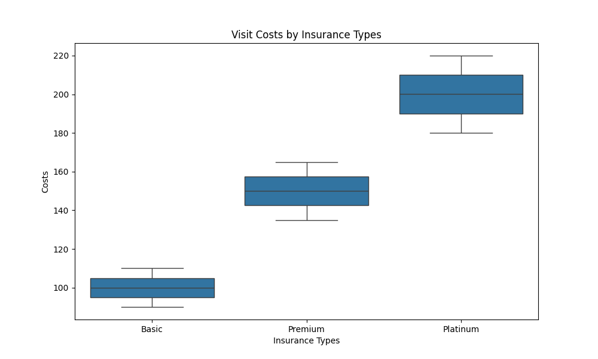

# DATASCI 217 Final Exam: Multiple Sclerosis Analysis

## Question 1: Data preparation with Command-Line Tools

The CSV file named, "ms_data_dirty.csv" was created by running "generate_dirty_data.py" python script. The comment lines, which starts with hash (#) was identified using "grep" and was excluded by the option "-v". The output from this command is then passed to the next command by pipe (|). Also, "sed" was used to filter empty lines using the pattern "/^$/, where ^ indicates the start of line and $ as the end of line. This is then deleted by "d". The output from the second command is then passed into the third command which removes extra commas. The "sed" command finds the double commas (,,) and substitutes (indicated by by "s") this with single comma (,). The "g" in the command indicates globally and is used to substitute all patterns found in each line. Then, the output extracted the columns with patient_id, visit_date, age, education_level and walking_speed based on the comma (,) delimiter. This output is then saved as a file named "ms_data.csv". In second part of the first question, a file "insurance.lst" is created by command "touch insurance.lst" with unique variables of insurance types - basic, premium, platinum added using "echo" command. Lastly, the total number of visits are counted and echoed. 

## Question 2: Data analysis with Python

The CSV file created in the previous question is loaded as "data". The column containing "visit_data" is converted to datetime using pd.to_datatime() from pandas and is sorted based on patient ID and visit dates inplace. The data file is further processed by randomly assigning insurance types to each patient ID. Insurance types are read from the insurance.lst file by reading each lines using line.strip() function. Random assignment is carried out by using random.Random function that assigns random insurance types to each patient ID, but is kept constant for the same patient ID by using hash function on the patient ID. The hash function generates a unique integer for the given patient ID. The visit_cost is also randomly generated based on the insurance types. The base costs for each insurance types are specified in base_cost variable with 100 for basic, 150 for premium, and 200 for platinum. Hence, based on the base costs, visit costs were randomly assigned to each visits with the variation between -10 % and 10 % from the base cost. Based on the processed data, summary statistics on mean walking speed by education level and mean costs by insurance type are generated using .mean() function and .groupby() function. For mean visit costs, the calculated value is rounded up to 2 decimal places using .round() function. For age effects on walking speed, the correlation matrix between age and walking speed is computed using .corr() function and the correlation coefficient in index [0,1] is accessed. This newly generated data is then saved as csv file "ms_data_w_insurance.csv".

Result for mean walking speed by education level: 
Based on the mean walking speed by education level, higher education levels are associated with higher walking speed with highest average speed of 4.48 for graduate level and the lowest average speed of 3.23 for high school. 

Result for mean costs by insurance type: 
The insurance types are significantly associated with visit costs, with highest insurance type with the highest average cost of 200.04.

Result for age effects on walking speed: 
The correlation between age and walking speed is -0.71. This indicates a strong negative correlation, meaning that walking speed decreases as age increases. This indicates the natural decline in mobility with aging. 

## Question 3: Statistical Analysis
### 3-1. Analyze walking speed

Walking speed was analyzed by creating a regression model with education and age as predictors. OLS regression model was performed using 'sm.OLS' from statsmodels library and was specified to "walking_speed ~ education_level + age" using '.from_formula()'. After defining the model, the parameters of the OLS regression model was estimated using '.fit()' method. ANOVA test (using '.anova_lm()') was performed for this model to evaluate the significance of each predictors in the OLS regression model. Coefficients and confidence intervals are also retrieved from the model using '.params()' and '.conf_int()'. 

Result: The multiple regression model for walking speed shows that education level and age are significant predictors, with R-squared value of 0.817, indicating 81.7 % of the variance in walking speed. The coefficients for each education levels indicates that higher education levels have a significantly higher walking speed compared to those with lower education level. Age has a negative coeefient of -0.03, indicating a steady decline in walking speed as age increases. The ANOVA results also shows that education level and age significantly influences the walking speed, with the p-values (0.00 for both) below 0.001. 

### 3-2. Analysis costs

Effects on costs by insurance type is analysed using simple statistics. The "visit_cost" data is grouped into a new variable called isnurance_grouped by insurance types. Mean and standard deviation is calculated for each visit costs data grouped by insurance types. Further statistical analysis on visit costs is carried out using ols model on "visit_cost ~ insurance_type" and fitted to the model using '.fit()' method. This model is also analyzed to observe any significant differences between the visit_costs and insurance types using ANOVA test. The box plot for costs vs insurance types is created seaborn package. The effect size on "visit_cost" were calculated using Cohen's d by first calculating the differences in mean between each groups insurance types. Then, pooled standard deiviation for each groups of insurance types are calculated using the equation "((basic.std()**2 + premium.std()**2) /2)**0.5" as an example. Cohen's d is then calculated by dividing the mean difference by the pooled standard deviation. 

Result: The analysis on visit costs shows a distinctive differences between insurance types. The mean visit cost is lowest for Basic insurance with 100.03, followed by Premium with 149.88 and Platinum with 200.03. Also, the variability in costs is the greatest for the highest insurance type, Platinum, followed by Premium and Bsic. The effect sizes between all three combinations of insurance types emphasizes the difference between the insurance types and that it plays a determining role in visit costs. 

### 3-3. Advanced analysis

Advanced analysis on education and age interaction effects on walking speed was performed using ols model and the equation is "walking_speed ~ education_level * age". To find another possible confounding factors other than age and education, the  remaining variable "visit_date" is used as potential confounder in the OLS regression model. Same OLS model is proceeded and the formula is "walking_speed ~ education_level * age + visit_date" is applied. 

Result: The advanced analysis was explored between edcuation level and age together on walking speed. Age and educaion level effects on walking speed individually shows a distinctive relationship. However, the effect of both predictors observed together does not suggest additional effects on walking speed. 

## Question 4: Data Visualization
### 4-1. Walking speed analysis

- To create a scatter plot of age vs walking speed with regression line, .lmplot() function from seaborn package was used. The graph shows that as age increases, walking speed decreases. 
- To create a box plots by education levels, .boxplot() function from seaborn package was used with education level on x-axis and age on y-axis. The walking speed remain relatively consistent between education levels, with no distinctive differences in walking speed by education level. 
- To create a line plot showing education age interaction with walking speed, .lineplot() function from seaborn was used. For better visualization, the line color was set to "Set1" with marker "x" color set to black. The graph shows that the walking speed decreases with age, and slight increase in walking speed with higher education level. However, the differences between the education levels are very weak and cannot by sharply defined by the graph.

### 4-2. Cost analysis
- Bar plot of mean costs by insurance types is created using .barplot() function with error bars included based on standard deviation of visit cost values. The order of insurance types are set to basic, premium and platinum. For better visualization, the color of the line are specified as well. The bar plot shows that the mean costs increases from the insurance types from basic to premium to platinum. 
- Box plots showing cost distributions by insurance types are created using .boxplot() function in the same order of insurance types. The box plot also shows the costs trends between the insurance types with lowest mean costs for basic, followed by premium and platinum. Also, the variations of mean costs for each insurance types is observed to remain within the -10 % and 10 % variation. 

### 4-3. Combined visualizations
- Pair plot of key variables - age, walking speed and visit cost - by insurance types were created using .pairplot() function in seaborn package. As shown in the graph between age and walking speed, the walking speed is the highest when the age is lowest. However, relationship between age and visit costs were known found as all different ages have variety of visit costs based on the insurance types. Also, the relationship between walking speed and visit costs were not explicitly shown from the graph. In overall, the clear relationship between visit cost and insurance types, and between age and walking speed were observed from the pair plot. 

- Faceted plots by education and insurance types are created using sns.FacetGrid() function and is mapped using .map() function. Four different faceted scatter plots based on different education levels were created with each labeled differently in color with different insurance types. Slight increase in walking speed by increase in education level and clear difference in visit costs by insurance types can be observed, but weak relationship between walking speed and visit cost were observed. 

- Time trend graph was created using .line() graph with x-axis with visit date and y-axis as visit costs. The data suggests that visit costs are directly related to the type of insurance, with Platinum the highest and Basic the lowest. There are fluctuations in the costs, but remain stable over time. No distinctive relationship between visit date and visit cost were observed from this graph. 

